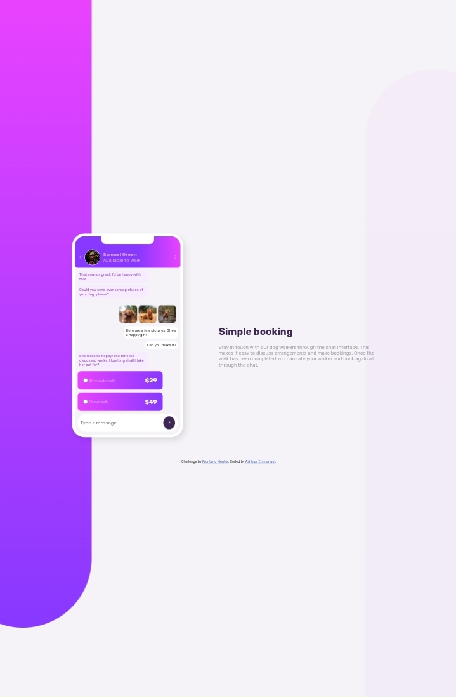
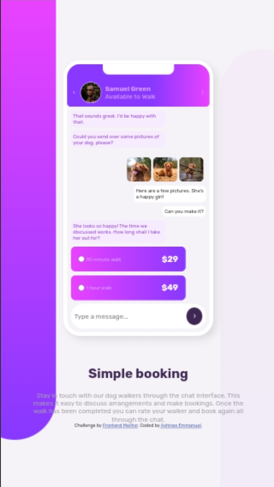

# Frontend Mentor - Chat app CSS illustration solution

This is a solution to the [Chat app CSS illustration challenge on Frontend Mentor](https://www.frontendmentor.io/challenges/chat-app-css-illustration-O5auMkFqY). Frontend Mentor challenges help you improve your coding skills by building realistic projects. 

## Table of contents

- [Overview](#overview)
  - [The challenge](#the-challenge)
  - [Screenshot](#screenshot)
  - [Links](#links)
- [My process](#my-process)
  - [Built with](#built-with)
  - [What I learned](#what-i-learned)
  - [Continued development](#continued-development)
- [Author](#author)


## Overview

### The challenge

Users should be able to:

- View the optimal layout for the component depending on their device's screen size
- **Bonus**: See the chat interface animate on the initial load

### Screenshot




### Links

- Solution URL: [my Solution code](./index.html)
- Live Site URL: [Add live site URL here](https://your-live-site-url.com)

## My process

### Built with

- Semantic HTML5 markup
- CSS custom properties
- Flexbox
- CSS Grid
- Mobile-first workflow
- [Boxicons](https://boxicons.com/?query=Che) - for action buttons


### What I learned

```css
   '''Creating animations'''
    #chat p, #chat div:not(#response){
      animation: flow 1s forwards;
    }
    @keyframes flow{
      from{
        transform: translateY(-1000px);
      }
      to{
        transform: translateY(0);
      }
    }
    '''Using CSS pseudo elemen'''
        #content::before{
      content: "y";
      position: absolute;
      background: hsl(0, 0%, 100%);
      color: hsl(0, 0%, 100%);
      transform: translateY(-.1em);
      z-index: 2;
      top: 0;
      left: 25%;
      right: 25%;
      height: 30px;
      border-bottom-right-radius: 1em;
      border-bottom-left-radius: 1em;
    }
           body::after{
      content: "";
      position: fixed;
      transform: translateX(150%);
      bottom: 0;
      height: 90%;
      width: 30%;
      border-top-left-radius: 20em;
      border-top-right-radius: 20em;
      background: linear-gradient(hsl(293, 100%, 63%), hsl(264, 100%, 61%));
      z-index: -1;
      opacity: .04;
    }
        body::before{
      content: "";
      position: fixed;
      transform: translateX(-150%);
      top: 0;
      height: 90%;
      width: 30%;
      border-bottom-left-radius: 20em;
      border-bottom-right-radius: 20em;
      background: linear-gradient(hsl(293, 100%, 63%), hsl(264, 100%, 61%));
      z-index: -1;
    }
```

### Continued development
Pseudo-Elements:Redesign a simple webpage using pseudo-elements for decorative purposes.Create a set of styled buttons with pseudo-elements.Implement a responsive navigation bar using pseudo-elements.

CSS Animations:Understand the @keyframes rule.Learn about the properties that can be animated (e.g., transform, opacity, color).Explore the syntax and usage of animation, animation-name, animation-duration, animation-timing-function, animation-delay, animation-iteration-count, and animation-direction.

## Author

- Frontend Mentor - [@Lord-Ace](https://www.frontendmentor.io/profile/lord-ace)